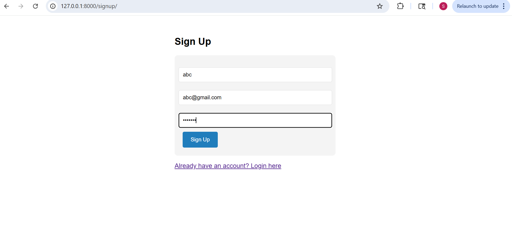
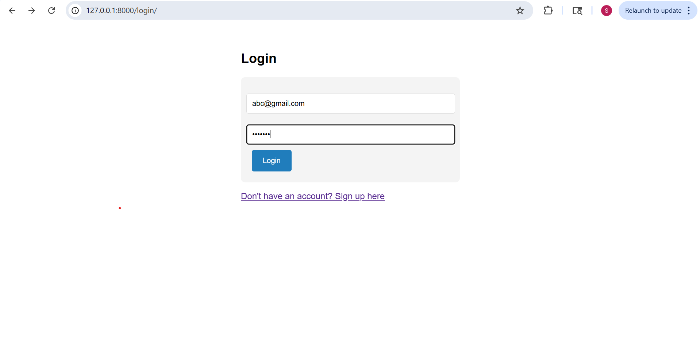
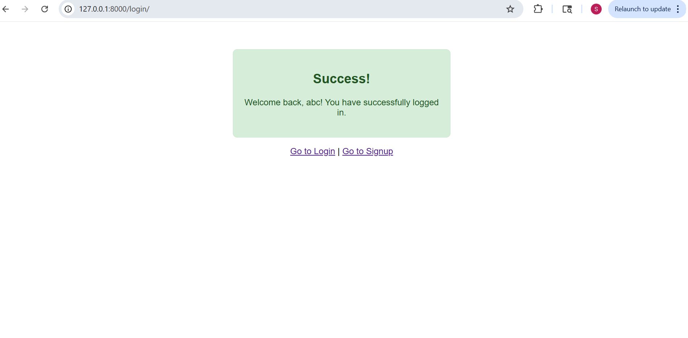
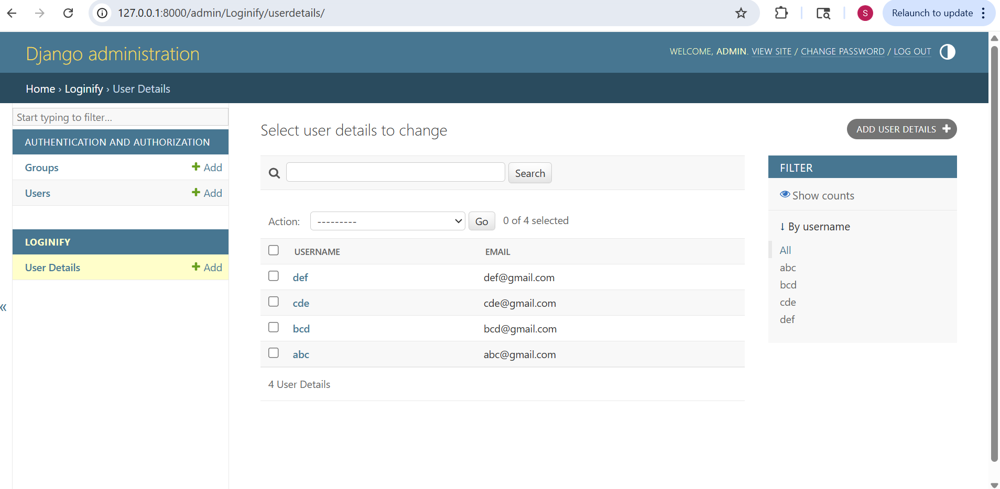

# Django Login System

A Django web application featuring user authentication and CRUD operations.

## Features Implemented:
- ✅ User Registration (Signup)
- ✅ User Authentication (Login) 
- ✅ Success page with personalized messages
- ✅ Admin interface for user management
- ✅ Complete CRUD API operations
- ✅ Postman-tested API endpoints

## Project Structure:
- **Project:** Login_System
- **App:** Loginify
- **Database:** SQLite with UserDetails model
- **Templates:** Responsive HTML forms

## API Endpoints:
- `GET /api/users/` - Get all users
- `GET /api/users/<email>/` - Get user by email
- `PUT /api/users/<email>/update/` - Update user password
- `DELETE /api/users/<email>/delete/` - Delete user
- `POST /signup/` - Create new user
- `POST /login/` - Authenticate user

## Setup Instructions:
1. Create virtual environment: `python -m venv DjangoAssignment`
2. Activate: `DjangoAssignment\Scripts\activate`
3. Install Django: `pip install django`
4. Run migrations: `python manage.py migrate`
5. Create superuser: `python manage.py createsuperuser`
6. Start server: `python manage.py runserver`

## Screenshots Included:
- Signup form
- Login form
- Success page
- Admin interface
- Postman API tests

## Screenshots

### 1. Signup Form

### 2. Login Form  

### 3. Success Page

### 4. Admin Interface

### 5. Postman API Tests

#### Get All Users
.png)

#### Get Single User
.png)

#### Update User
.png)

#### Delete User
.png)